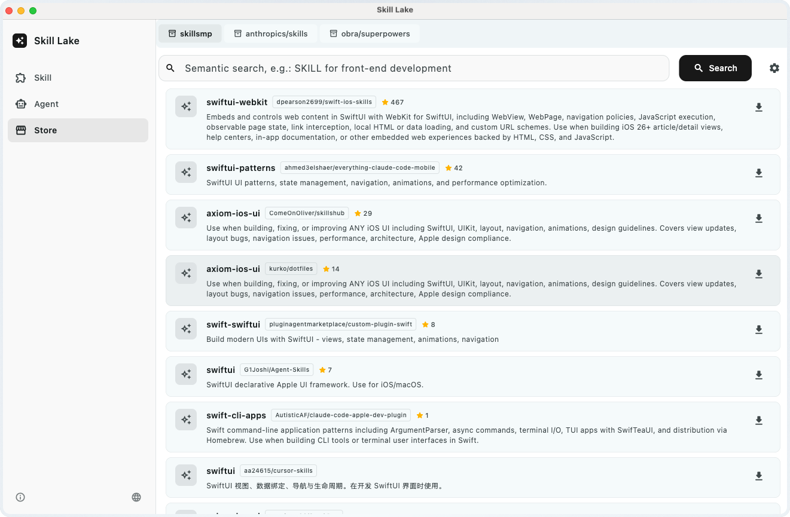

# 🌊 Skill Lake

[简体中文](./README_zh.md) | English


**Skill Lake** is a cross-platform (macOS / Windows) management tool for AI Agent Skills. It supports searching, installing, deleting, and syncing skills.



## Core Features

- **Semantic Search**: Powered by the skillsmp API, enabling AI-driven semantic search to discover skills efficiently.
- **One-stop Skill Management**: Compatible with and manages the lifecycle of skills for various popular AI programming assistants.
- **Rich Skill Store**: Aggregates high-quality open-source skill libraries from GitHub (such as `anthropics/skills`), explore the latest and most powerful AI skills and install them with one click.
- **Skill Sync**: Supports setting a default AI Agent and enables one-click flexible distribution and synchronization of skills to other agents.

## Supported AI Agents

| AI Tool | Local Skills Path | Official Website |
| :--- | :--- | :--- |
| **Cursor** | `~/.cursor/skills/` (Windows: `%USERPROFILE%\\.cursor\\skills` or `%APPDATA%\\Cursor\\skills`) | <https://cursor.com/> |
| **Claude Code** | `~/.claude/skills/` (Windows: `%USERPROFILE%\\.claude\\skills` or `%APPDATA%\\Claude\\skills`) | <https://claude.com/product/claude-code> |
| **Codex** | `~/.codex/skills/` (Windows: `%USERPROFILE%\\.codex\\skills` or `%APPDATA%\\Codex\\skills`) | <https://openai.com/codex> |
| **Trae** | `~/.trae/skills/` (Windows: `%USERPROFILE%\\.trae\\skills` or `%APPDATA%\\Trae\\skills`) | <https://www.trae.ai/> |
| **Gemini CLI** | `~/.gemini/skills/` (Windows: `%USERPROFILE%\\.gemini\\skills`) | <https://geminicli.com/> |
| **Antigravity** | `~/.gemini/antigravity/skills/` (Windows: `%USERPROFILE%\\.gemini\\antigravity\\skills` or `%APPDATA%\\Antigravity\\skills`) | <https://antigravity.google/> |
| **GitHub Copilot** | `~/.copilot/skills/` (Windows: `%USERPROFILE%\\.copilot\\skills` or `%APPDATA%\\Copilot\\skills`) | <https://github.com/features/copilot> |

## Installation

### macOS (Recommended)

Install via Homebrew:

```bash
brew tap emlog/skill-lake
brew install --cask skill-lake
```

### Windows

Please download the latest `.exe` installer from the [Releases](https://github.com/emlog/skill-lake/releases) page.

## Update

```bash
brew update
brew upgrade --cask skill-lake
```

## Build from Source

### **1. Clone the project source code**:

```bash
git clone https://github.com/emlog/skill-lake.git
cd skill-lake
```

### **2. Enable desktop development support** (if you are running a Flutter desktop project for the first time):

- macOS:

```bash
flutter config --enable-macos-desktop
```

- Windows:

```bash
flutter config --enable-windows-desktop
```

### **3. Get project dependencies**:

```bash
flutter pub get
```

### **4. Compile and start the application**:

- macOS:

```bash
flutter run -d macos
```

- Windows:

```bash
flutter run -d windows
```


## ❓ FAQ

### ⚠️ Warning: "Skill Lake is damaged and can't be opened. You should move it to the Trash."

Since the application has not yet been signed and notarized with an Apple Developer certificate, macOS's Gatekeeper mechanism may block this application and give a "damaged" or "move to Trash" warning.

**Solution:**
1. When the prompt appears, first click **"Cancel"** on the pop-up window.
2. Open macOS **"System Settings"** > **"Privacy & Security"**.
3. Scroll down to the "Security" section, where there will be an interception record (indicating "Skill Lake" has been blocked).
4. Click the **"Open Anyway"** (or **"Allow Anyway"**) button next to it, and enter your Mac login password or authorize via Touch ID in the pop-up security verification.
5. After authorization is completed, try to open **Skill Lake** again. An **"Open"** button will appear in the confirmation box. After clicking it, the system will remember your choice and you will not be blocked again.
